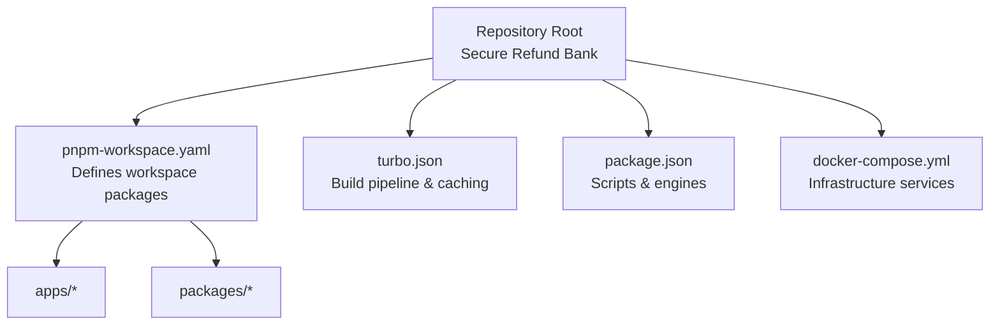
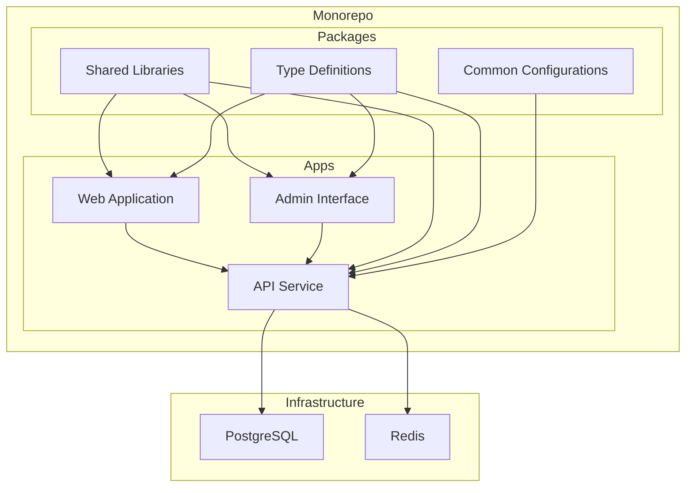
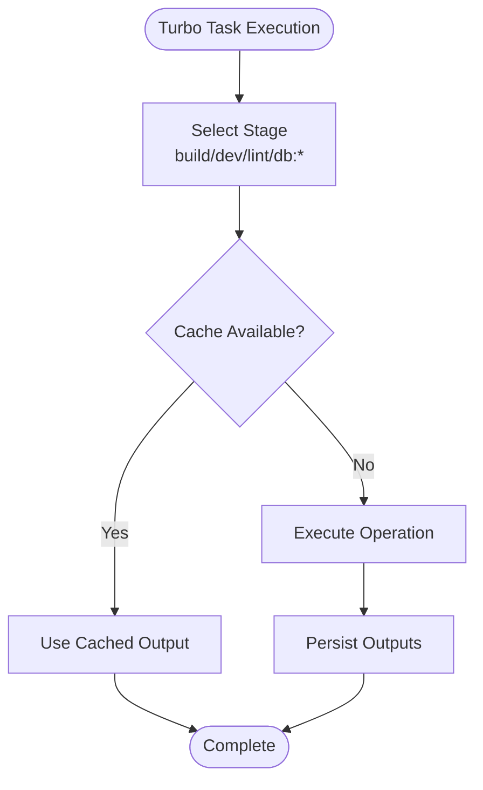
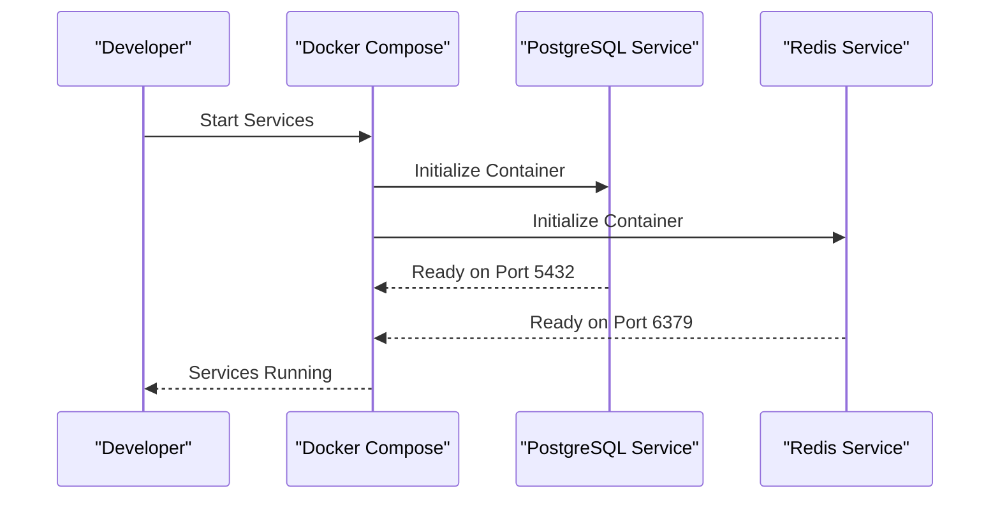
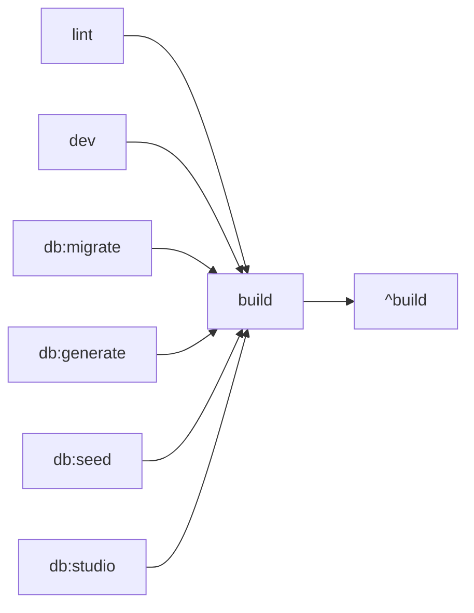

# Architecture Overview

<cite>
**Referenced Files in This Document**
- [package.json](file://package.json)
- [pnpm-workspace.yaml](file://pnpm-workspace.yaml)
- [turbo.json](file://turbo.json)
- [docker-compose.yml](file://docker-compose.yml)
</cite>

## Table of Contents
1. [Introduction](#introduction)
2. [Project Structure](#project-structure)
3. [Core Components](#core-components)
4. [Architecture Overview](#architecture-overview)
5. [Detailed Component Analysis](#detailed-component-analysis)
6. [Dependency Analysis](#dependency-analysis)
7. [Performance Considerations](#performance-considerations)
8. [Troubleshooting Guide](#troubleshooting-guide)
9. [Conclusion](#conclusion)

## Introduction
This document describes the Secure Refund Bank system architecture as implemented in the provided monorepo. The system employs PNPM workspaces for package management and Turborepo for build orchestration, with a focus on a microservices pattern. The banking infrastructure stack follows a database-first design approach and uses containerization for local development and testing. Cross-cutting concerns include build optimization, dependency management, and coordinated development workflows.

## Project Structure
The repository is a minimal monorepo configuration that defines:
- Workspace packages under apps and packages
- Turborepo pipeline for build, development, linting, and database tasks
- Docker Compose services for PostgreSQL and Redis

**Diagram sources**
- [pnpm-workspace.yaml:1-4](file://pnpm-workspace.yaml#L1-L4)
- [turbo.json:1-29](file://turbo.json#L1-L29)
- [package.json:1-22](file://package.json#L1-L22)
- [docker-compose.yml:1-29](file://docker-compose.yml#L1-L29)

**Section sources**
- [pnpm-workspace.yaml:1-4](file://pnpm-workspace.yaml#L1-L4)
- [turbo.json:1-29](file://turbo.json#L1-L29)
- [package.json:1-22](file://package.json#L1-L22)
- [docker-compose.yml:1-29](file://docker-compose.yml#L1-L29)

## Core Components
- Monorepo management via PNPM workspaces
  - Declares app and package directories for workspace discovery
- Build orchestration via Turborepo
  - Pipeline stages: build, dev, lint, db:migrate, db:generate, db:seed, db:studio
  - Caching and incremental builds with global dependencies
- Infrastructure provisioning via Docker Compose
  - PostgreSQL service with persistent volumes
  - Redis service with persistent volumes
- Development scripts in package.json
  - Unified commands to trigger Turborepo tasks

Key implementation patterns:
- Database-first design approach indicated by dedicated database tasks (migrate, generate, seed, studio)
- Containerized infrastructure for consistent local environments
- Microservices-friendly structure enabling independent scaling and deployment of services

**Section sources**
- [pnpm-workspace.yaml:1-4](file://pnpm-workspace.yaml#L1-L4)
- [turbo.json:4-26](file://turbo.json#L4-L26)
- [package.json:5-12](file://package.json#L5-L12)
- [docker-compose.yml:3-29](file://docker-compose.yml#L3-L29)

## Architecture Overview
The system architecture centers on a monorepo with Turborepo orchestration and containerized infrastructure. The microservices pattern is implied by the workspace structure, allowing teams to develop and deploy services independently while sharing common packages.

System context relationships:
- Web Application and Admin Interface consume the API Service
- API Service interacts with the database and cache layers
- Shared packages provide reusable logic across applications
- Infrastructure services support persistence and caching

**Diagram sources**
- [pnpm-workspace.yaml:1-4](file://pnpm-workspace.yaml#L1-L4)
- [turbo.json:4-26](file://turbo.json#L4-L26)
- [docker-compose.yml:3-29](file://docker-compose.yml#L3-L29)

## Detailed Component Analysis

### PNPM Workspaces
- Purpose: Define workspace boundaries for apps and packages
- Behavior: Enables hoisted dependency management and cross-package linking
- Impact: Reduces duplication and simplifies development across services

Implementation highlights:
- Workspace globs for apps and packages directories
- Integrated with Turborepo for task orchestration

**Section sources**
- [pnpm-workspace.yaml:1-4](file://pnpm-workspace.yaml#L1-L4)

### Turborepo Pipeline
- Build stage
  - Depends on upstream build outputs (^build)
  - Outputs cached for .next and dist directories
- Dev stage
  - Non-cached, persistent processes for interactive development
- Database tasks
  - Non-cached operations for migrations, generation, seeding, and studio access
- Global dependencies
  - Environment files with .env.*local suffixes

Processing logic:
- Incremental builds leverage dependsOn and outputs
- Development mode prioritizes responsiveness over caching
- Database operations bypass cache to ensure correctness

**Diagram sources**
- [turbo.json:4-26](file://turbo.json#L4-L26)

**Section sources**
- [turbo.json:1-29](file://turbo.json#L1-L29)

### Docker Compose Infrastructure
- PostgreSQL service
  - Versioned Alpine image
  - Persistent volume for data durability
  - Network exposure on port 5432
- Redis service
  - Versioned Alpine image
  - Persistent volume for data durability
  - Network exposure on port 6379

Containerization strategy:
- Lightweight Alpine images for efficient resource usage
- Named containers for predictable management
- Volume mounts for persistence across restarts

**Diagram sources**
- [docker-compose.yml:3-29](file://docker-compose.yml#L3-L29)

**Section sources**
- [docker-compose.yml:1-29](file://docker-compose.yml#L1-L29)

### Development Scripts
- Unified commands delegate to Turborepo
  - build, dev, lint, db:migrate, db:generate, db:seed, db:studio
- Engine constraints ensure compatible Node.js runtime

Development workflow coordination:
- Consistent task execution across the monorepo
- Centralized scripts simplify developer onboarding

**Section sources**
- [package.json:5-12](file://package.json#L5-L12)
- [package.json:17-20](file://package.json#L17-L20)

## Dependency Analysis
Workspace and pipeline dependencies:
- Turborepo build stage depends on upstream build outputs
- Database tasks are isolated from caching to prevent stale state
- Global environment files influence task execution

**Diagram sources**
- [turbo.json:4-26](file://turbo.json#L4-L26)

**Section sources**
- [turbo.json:3-26](file://turbo.json#L3-L26)

## Performance Considerations
- Build optimization
  - Incremental builds via dependsOn and outputs
  - Separate caching strategy for development vs. production
- Dependency management
  - PNPM workspaces reduce duplication and speed up installs
- Database operations
  - Non-cached database tasks ensure correctness during migrations and seeds

## Troubleshooting Guide
- Database tasks failing
  - Verify PostgreSQL and Redis containers are healthy
  - Confirm environment variables align with compose configuration
- Build cache issues
  - Clear Turborepo cache if outputs become stale
  - Re-run build after dependency changes
- Development server problems
  - Restart dev processes if persistent tasks stall
  - Check globalDependencies for missing environment files

**Section sources**
- [docker-compose.yml:3-29](file://docker-compose.yml#L3-L29)
- [turbo.json:3-26](file://turbo.json#L3-L26)

## Conclusion
The Secure Refund Bank architecture establishes a robust foundation for a scalable, database-first banking system. The PNPM workspaces and Turborepo pipeline enable efficient development and deployment workflows, while Docker Compose provides reliable infrastructure for local environments. The microservices pattern, supported by shared packages, allows teams to evolve services independently while maintaining consistency through common configurations and libraries.