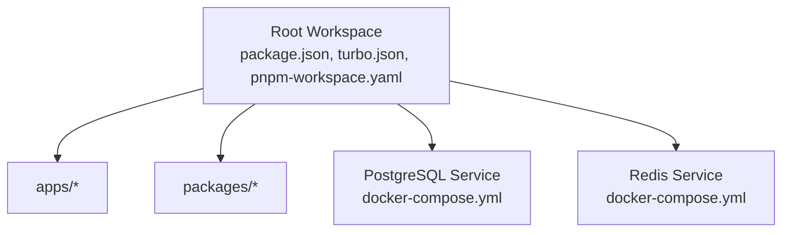
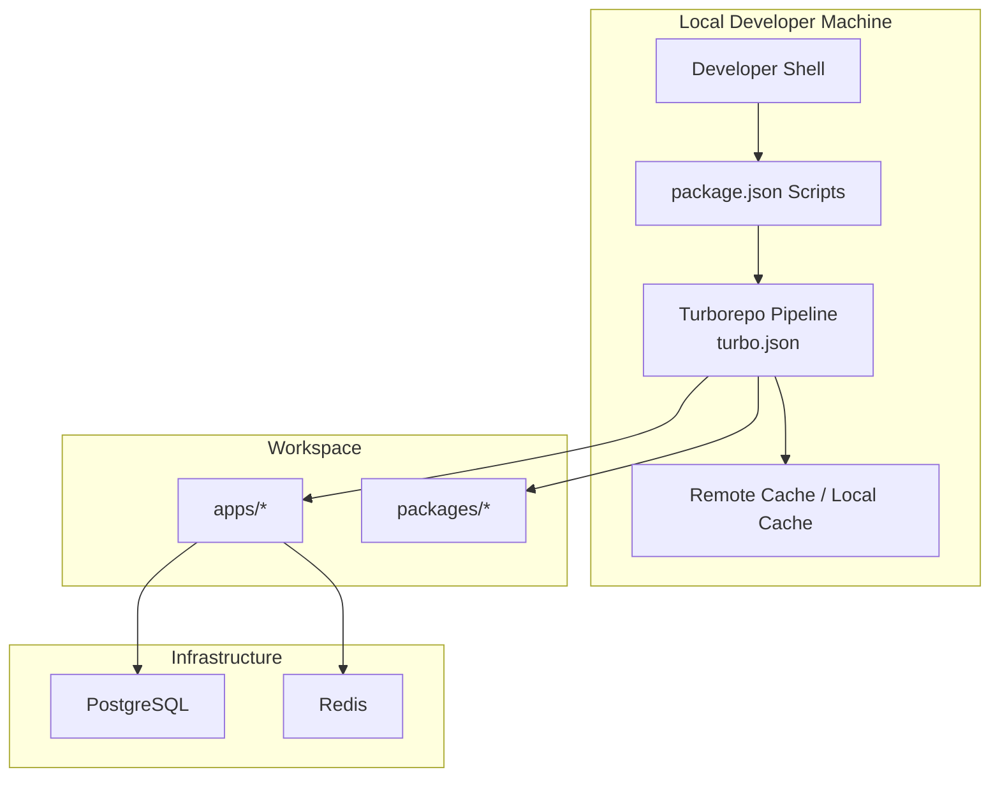
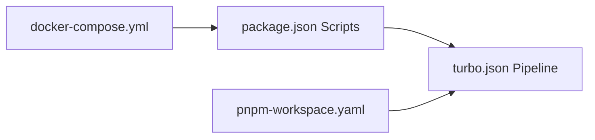

# Build and Deployment

<cite>
**Referenced Files in This Document**
- [package.json](file://package.json)
- [turbo.json](file://turbo.json)
- [pnpm-workspace.yaml](file://pnpm-workspace.yaml)
- [docker-compose.yml](file://docker-compose.yml)
</cite>

## Table of Contents
1. [Introduction](#introduction)
2. [Project Structure](#project-structure)
3. [Core Components](#core-components)
4. [Architecture Overview](#architecture-overview)
5. [Detailed Component Analysis](#detailed-component-analysis)
6. [Dependency Analysis](#dependency-analysis)
7. [Performance Considerations](#performance-considerations)
8. [Troubleshooting Guide](#troubleshooting-guide)
9. [Conclusion](#conclusion)
10. [Appendices](#appendices)

## Introduction
This document explains the build and deployment configuration for the Secure Refund Bank project. It focuses on the Turborepo-based build pipeline, script orchestration via package.json, caching behavior, and operational differences between development and production builds. It also covers database lifecycle tasks, local infrastructure provisioning via Docker Compose, and practical guidance for CI/CD, artifact management, and deployment preparation tailored for banking-grade systems.

## Project Structure
The repository is a Turborepo workspace configured with PNPM. The workspace defines two package globs for applications and shared packages, and the root orchestrates build, development, linting, and database tasks through Turborepo.

**Diagram sources**
- [pnpm-workspace.yaml:1-4](file://pnpm-workspace.yaml#L1-L4)
- [docker-compose.yml:1-29](file://docker-compose.yml#L1-L29)

**Section sources**
- [pnpm-workspace.yaml:1-4](file://pnpm-workspace.yaml#L1-L4)
- [package.json:1-22](file://package.json#L1-L22)
- [turbo.json:1-29](file://turbo.json#L1-L29)
- [docker-compose.yml:1-29](file://docker-compose.yml#L1-L29)

## Core Components
- Root scripts in package.json delegate to Turborepo:
  - build, dev, lint, db:migrate, db:generate, db:seed, db:studio
- Turborepo pipeline in turbo.json configures task dependencies, outputs, caching, and persistence.
- Workspace configuration in pnpm-workspace.yaml defines package discovery scope.
- Local infrastructure in docker-compose.yml provisions PostgreSQL and Redis for development and testing.

Key responsibilities:
- Orchestrate monorepo-wide tasks from the root.
- Define cacheable outputs and non-cacheable tasks (e.g., dev, database ops).
- Persist long-running development and studio tasks.
- Provide local database and cache services for development.

**Section sources**
- [package.json:5-12](file://package.json#L5-L12)
- [turbo.json:4-27](file://turbo.json#L4-L27)
- [pnpm-workspace.yaml:1-4](file://pnpm-workspace.yaml#L1-L4)
- [docker-compose.yml:3-29](file://docker-compose.yml#L3-L29)

## Architecture Overview
The build and deployment architecture centers on Turborepo’s pipeline and the root package scripts. The diagram below maps the primary flows for building, developing, linting, and database operations.

**Diagram sources**
- [package.json:5-12](file://package.json#L5-L12)
- [turbo.json:4-27](file://turbo.json#L4-L27)
- [pnpm-workspace.yaml:1-4](file://pnpm-workspace.yaml#L1-L4)
- [docker-compose.yml:3-29](file://docker-compose.yml#L3-L29)

## Detailed Component Analysis

### Root Scripts and Turborepo Task Mapping
- The root package.json scripts forward commands to Turborepo:
  - build → turbo run build
  - dev → turbo run dev
  - lint → turbo run lint
  - db:* → turbo run db:migrate | db:generate | db:seed | db:studio
- These scripts enable consistent task invocation across environments and CI runners.

Practical usage:
- Run the full build: npm run build
- Start development servers: npm run dev
- Lint the entire workspace: npm run lint
- Manage database state: npm run db:migrate, npm run db:generate, npm run db:seed, npm run db:studio

**Section sources**
- [package.json:5-12](file://package.json#L5-L12)

### Turborepo Pipeline Configuration
- Global dependencies:
  - Watches environment files with .local suffixes to invalidate caches when secrets change.
- Task-level configuration:
  - build
    - dependsOn: ^build enforces topological ordering across packages.
    - outputs: .next/**, dist/**; excludes .next/cache/** to avoid caching transient data.
  - dev
    - cache: false disables caching for iterative development.
    - persistent: true keeps the task alive across file changes.
  - lint
    - No special flags; runs lint checks across packages.
  - db:* tasks
    - cache: false to prevent unintended reuse of database operations.
    - db:studio additionally sets persistent: true for interactive sessions.

Caching and persistence implications:
- Non-cacheable tasks (dev, db:*) ensure correctness during interactive development and imperative operations.
- Cacheable outputs (build) accelerate CI and local builds by reusing artifacts.

**Section sources**
- [turbo.json:2-27](file://turbo.json#L2-L27)

### Workspace Package Discovery
- The pnpm-workspace.yaml defines:
  - apps/*
  - packages/*
- This determines which directories Turborepo considers part of the monorepo for task execution and dependency resolution.

**Section sources**
- [pnpm-workspace.yaml:1-4](file://pnpm-workspace.yaml#L1-L4)

### Local Infrastructure Provisioning
- docker-compose.yml provisions:
  - PostgreSQL service with named volume for durable storage.
  - Redis service with named volume for caching and session data.
- Ports are mapped for local access:
  - PostgreSQL: 5432
  - Redis: 6379

Operational notes:
- Use docker-compose up to start services locally.
- Volumes persist data across container restarts.

**Section sources**
- [docker-compose.yml:3-29](file://docker-compose.yml#L3-L29)

### Build and Development Workflows
- Development workflow:
  - npm run dev starts Turborepo’s dev task, which is non-cacheable and persistent.
  - Ideal for interactive development with hot reloading and live updates.
- Production build workflow:
  - npm run build executes Turborepo’s build task with cacheable outputs.
  - Outputs exclude .next/cache/** to keep caches out of artifacts.
  - dependsOn: ^build ensures topological correctness across packages.

Optimization strategies:
- Keep cacheable outputs minimal and deterministic.
- Exclude transient directories (e.g., cache) from outputs to reduce artifact size.
- Use globalDependencies to invalidate cache when environment files change.

**Section sources**
- [turbo.json:5-12](file://turbo.json#L5-L12)
- [turbo.json:7](file://turbo.json#L7)
- [package.json:6-7](file://package.json#L6-L7)

### Database Lifecycle Tasks
- db:migrate, db:generate, db:seed, db:studio are forwarded to Turborepo with cache disabled.
- These tasks are intended for imperative operations against a local or CI database.
- db:studio is persistent to support interactive database tooling.

Best practices:
- Run migrations before starting the app in CI or staging.
- Use db:generate to scaffold new migration files during development.
- Use db:seed to populate test fixtures in development and CI.

**Section sources**
- [package.json:9-12](file://package.json#L9-L12)
- [turbo.json:14-26](file://turbo.json#L14-L26)

### CI/CD Considerations
- Cache invalidation:
  - Global dependencies watch .env.*local files to bust caches when secrets change.
- Artifact management:
  - Build outputs include .next/** and dist/**; exclude .next/cache/** to avoid bloated artifacts.
- Task isolation:
  - Non-cacheable tasks (dev, db:*) prevent stale state in CI.
- Persistent tasks:
  - dev and db:studio are marked persistent to support long-running processes in CI logs or ephemeral environments.

**Section sources**
- [turbo.json:3](file://turbo.json#L3)
- [turbo.json:7](file://turbo.json#L7)
- [turbo.json:9-12](file://turbo.json#L9-L12)
- [turbo.json:23-26](file://turbo.json#L23-L26)

## Dependency Analysis
The root package.json scripts depend on Turborepo tasks defined in turbo.json. The workspace layout in pnpm-workspace.yaml determines which packages participate in the pipeline. Database tasks rely on local infrastructure provisioned by docker-compose.yml.

**Diagram sources**
- [package.json:5-12](file://package.json#L5-L12)
- [turbo.json:4-27](file://turbo.json#L4-L27)
- [pnpm-workspace.yaml:1-4](file://pnpm-workspace.yaml#L1-L4)
- [docker-compose.yml:3-29](file://docker-compose.yml#L3-L29)

**Section sources**
- [package.json:5-12](file://package.json#L5-L12)
- [turbo.json:4-27](file://turbo.json#L4-L27)
- [pnpm-workspace.yaml:1-4](file://pnpm-workspace.yaml#L1-L4)
- [docker-compose.yml:3-29](file://docker-compose.yml#L3-L29)

## Performance Considerations
- Caching:
  - Build outputs are cacheable; non-cacheable tasks (dev, db:*) ensure correctness during interactive development.
- Output pruning:
  - Excluding .next/cache/** reduces artifact size and avoids caching transient data.
- Persistence:
  - Persistent tasks (dev, db:studio) keep long-running processes alive across changes.
- Global dependencies:
  - Watching .env.*local files ensures cache invalidation when secrets change.

[No sources needed since this section provides general guidance]

## Troubleshooting Guide
Common issues and resolutions:
- Unexpected cache hits after secret changes:
  - Ensure .env.*local files are present and updated; Turborepo invalidates cache on changes to these files.
- Dev server not picking up changes:
  - Verify dev task is persistent and cache is disabled for dev.
- Database tasks failing in CI:
  - Confirm local infrastructure is available or configure CI database connections accordingly.
- Large build artifacts:
  - Confirm .next/cache/** is excluded from outputs and only necessary build outputs are included.

**Section sources**
- [turbo.json:3](file://turbo.json#L3)
- [turbo.json:9-12](file://turbo.json#L9-L12)
- [turbo.json:7](file://turbo.json#L7)
- [docker-compose.yml:3-29](file://docker-compose.yml#L3-L29)

## Conclusion
The Secure Refund Bank project leverages Turborepo for scalable build orchestration, with clear separation between development and production concerns. Root scripts provide a unified interface, while turbo.json governs caching, persistence, and output management. The pnpm workspace configuration scopes packages, and docker-compose supplies essential infrastructure for local development. These elements combine to support reliable CI/CD, optimized builds, and safe deployment preparation for banking-grade applications.

[No sources needed since this section summarizes without analyzing specific files]

## Appendices

### Appendix A: Practical Examples
- Build preparation:
  - Run npm run build to produce cacheable outputs for distribution.
- Development:
  - Run npm run dev to start persistent, non-cached development servers.
- Linting:
  - Run npm run lint to enforce code quality across the workspace.
- Database operations:
  - Run npm run db:migrate to apply migrations.
  - Run npm run db:generate to scaffold new migration files.
  - Run npm run db:seed to populate test data.
  - Run npm run db:studio to open an interactive database tool.

**Section sources**
- [package.json:5-12](file://package.json#L5-L12)
- [turbo.json:4-27](file://turbo.json#L4-L27)