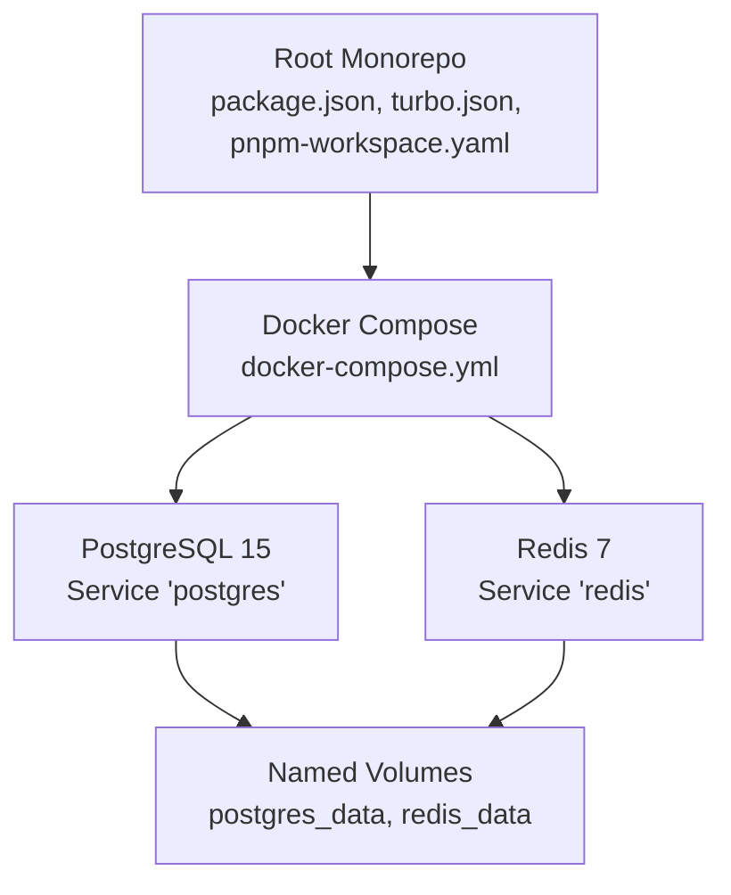
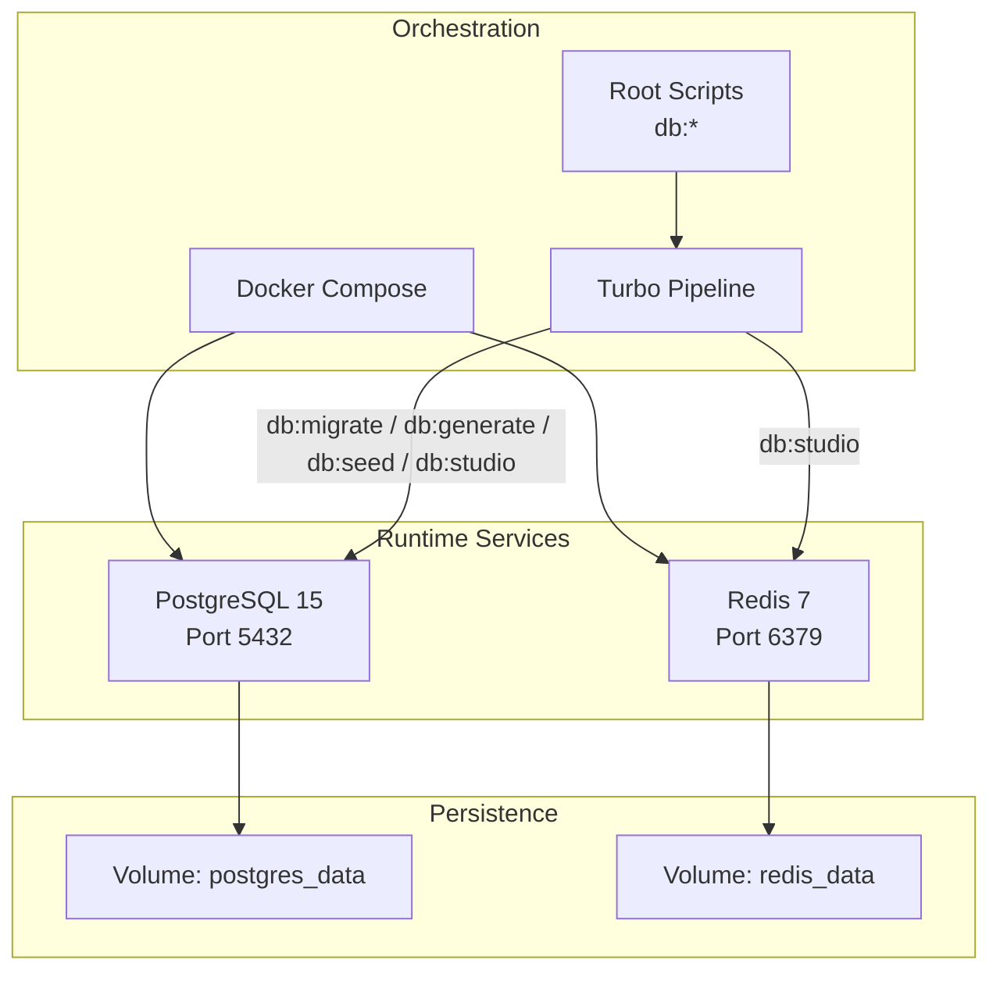
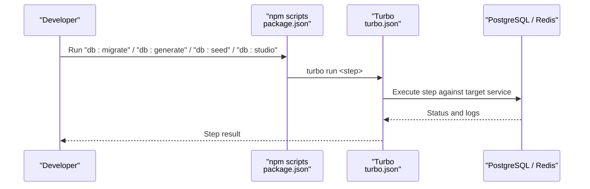
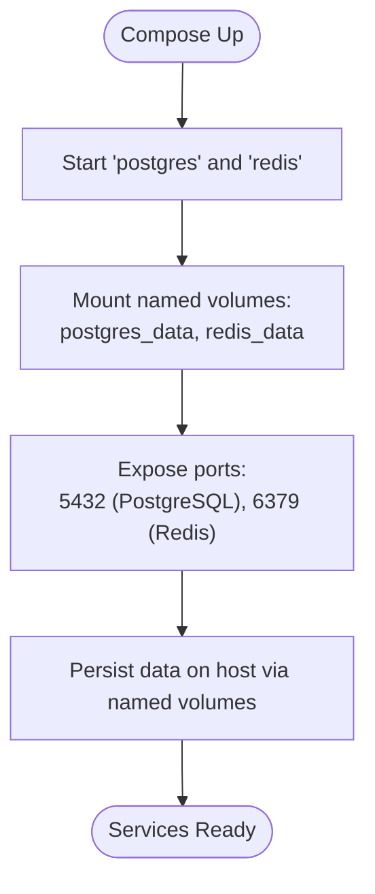
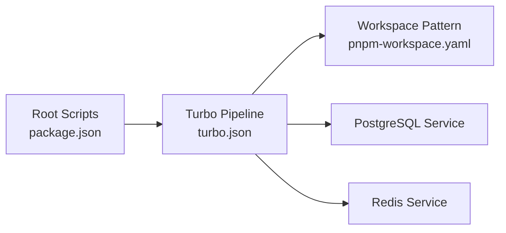

# Database Management

<cite>
**Referenced Files in This Document**
- [docker-compose.yml](file://docker-compose.yml)
- [package.json](file://package.json)
- [turbo.json](file://turbo.json)
- [pnpm-workspace.yaml](file://pnpm-workspace.yaml)
</cite>

## Table of Contents
1. [Introduction](#introduction)
2. [Project Structure](#project-structure)
3. [Core Components](#core-components)
4. [Architecture Overview](#architecture-overview)
5. [Detailed Component Analysis](#detailed-component-analysis)
6. [Dependency Analysis](#dependency-analysis)
7. [Performance Considerations](#performance-considerations)
8. [Troubleshooting Guide](#troubleshooting-guide)
9. [Conclusion](#conclusion)
10. [Appendices](#appendices)

## Introduction
This document provides comprehensive database management guidance for the Secure Refund Bank project. It covers PostgreSQL 15 and Redis 7 configuration via Docker Compose, database lifecycle management (migrations, schema generation, seeding, Studio access), service orchestration, volume persistence, and backup strategies. It also includes practical command examples, connection configuration guidance, troubleshooting tips, and data modeling/performance recommendations tailored for banking transaction workloads.

## Project Structure
The repository is a monorepo managed with pnpm and Turbo. Database lifecycle scripts are exposed at the root level and orchestrated by Turbo. PostgreSQL and Redis are provisioned as Docker services with named volumes for persistence.

**Diagram sources**
- [docker-compose.yml:1-29](file://docker-compose.yml#L1-L29)
- [package.json:1-22](file://package.json#L1-L22)
- [turbo.json:1-29](file://turbo.json#L1-L29)
- [pnpm-workspace.yaml:1-4](file://pnpm-workspace.yaml#L1-L4)

**Section sources**
- [docker-compose.yml:1-29](file://docker-compose.yml#L1-L29)
- [package.json:1-22](file://package.json#L1-L22)
- [turbo.json:1-29](file://turbo.json#L1-L29)
- [pnpm-workspace.yaml:1-4](file://pnpm-workspace.yaml#L1-L4)

## Core Components
- PostgreSQL 15 service configured with:
  - Environment variables for user, password, and database name
  - Port mapping for local access
  - Persistent volume for data durability
- Redis 7 service configured with:
  - Port mapping for local access
  - Persistent volume for data durability
- Root-level scripts delegate database tasks to Turbo pipeline steps:
  - db:migrate, db:generate, db:seed, db:studio

Key operational characteristics:
- Services use restart policies to maintain availability
- Named volumes ensure data persists across container recreation
- Scripts are designed to be executed from the repository root

**Section sources**
- [docker-compose.yml:3-28](file://docker-compose.yml#L3-L28)
- [package.json:5-12](file://package.json#L5-L12)
- [turbo.json:14-26](file://turbo.json#L14-L26)

## Architecture Overview
The database runtime architecture centers on two primary services orchestrated by Docker Compose. The monorepo’s database lifecycle is managed by Turbo, which executes tasks consistently across the workspace.

**Diagram sources**
- [docker-compose.yml:3-28](file://docker-compose.yml#L3-L28)
- [turbo.json:14-26](file://turbo.json#L14-L26)
- [package.json:5-12](file://package.json#L5-L12)

## Detailed Component Analysis

### PostgreSQL 15 Configuration
- Image and runtime:
  - Uses the official postgres:15-alpine image
  - Container named srb-postgres
  - Restart policy set to unless-stopped
- Environment:
  - Username, password, and database name are defined via environment variables
- Networking:
  - Exposes port 5432 on the host
- Storage:
  - Persists data under the postgres_data volume mounted at the container’s data directory

Operational implications:
- Local connectivity is available on port 5432
- Data survives container recreation due to named volume
- Default superuser credentials are embedded in the compose file; treat as sensitive and change in production

**Section sources**
- [docker-compose.yml:4-15](file://docker-compose.yml#L4-L15)

### Redis 7 Configuration
- Image and runtime:
  - Uses the official redis:7-alpine image
  - Container named srb-redis
  - Restart policy set to unless-stopped
- Networking:
  - Exposes port 6379 on the host
- Storage:
  - Persists data under the redis_data volume mounted at /data

Operational implications:
- Local connectivity is available on port 6379
- Data survives container recreation due to named volume
- Suitable for caching and session storage in banking applications

**Section sources**
- [docker-compose.yml:17-24](file://docker-compose.yml#L17-L24)

### Database Lifecycle Management
Lifecycle commands are exposed as npm scripts and executed through Turbo. The pipeline defines cache and persistence behavior per step.

- Migration
  - Command: db:migrate
  - Execution: turbo run db:migrate
  - Behavior: Non-cached step
- Schema Generation
  - Command: db:generate
  - Execution: turbo run db:generate
  - Behavior: Non-cached step
- Seeding
  - Command: db:seed
  - Execution: turbo run db:seed
  - Behavior: Non-cached step
- Studio Access
  - Command: db:studio
  - Execution: turbo run db:studio
  - Behavior: Non-cached, persistent step

Workspace integration:
- The monorepo uses pnpm and Turbo
- Global dependencies include environment files
- Workspace pattern matches apps/* and packages/*

**Diagram sources**
- [package.json:5-12](file://package.json#L5-L12)
- [turbo.json:14-26](file://turbo.json#L14-L26)

**Section sources**
- [package.json:5-12](file://package.json#L5-L12)
- [turbo.json:14-26](file://turbo.json#L14-L26)
- [pnpm-workspace.yaml:1-4](file://pnpm-workspace.yaml#L1-L4)

### Service Orchestration and Volume Persistence
- Orchestration:
  - Docker Compose manages both services with explicit container names
  - Restart policies ensure resilience
- Volume Persistence:
  - postgres_data and redis_data are declared at the root level and attached to their respective services
  - This guarantees data durability across service restarts and rebuilds

**Diagram sources**
- [docker-compose.yml:3-28](file://docker-compose.yml#L3-L28)

**Section sources**
- [docker-compose.yml:3-28](file://docker-compose.yml#L3-L28)

### Backup Strategies
Recommended approaches for securing banking data:
- PostgreSQL
  - Use logical backups with pg_dump for point-in-time recoverability
  - Schedule periodic dumps and retain rotation windows
  - Store backups in a secure, offsite location or encrypted storage
- Redis
  - Enable AOF persistence and configure snapshotting for durability
  - Back up the persisted data directory regularly
  - Consider snapshots for quick restoration during maintenance windows

Note: Implement backup automation externally to the provided compose stack.

[No sources needed since this section provides general guidance]

### Practical Commands and Connection Configuration
- Start services
  - docker compose up -d
- Stop services
  - docker compose down
- View service logs
  - docker compose logs postgres
  - docker compose logs redis
- Connect to PostgreSQL locally
  - Host: localhost
  - Port: 5432
  - Database: secure_refund_bank
  - User: srb_user
  - Password: srb_password
- Connect to Redis locally
  - Host: localhost
  - Port: 6379
- Run database lifecycle steps
  - npm run db:migrate
  - npm run db:generate
  - npm run db:seed
  - npm run db:studio

Connection security recommendations:
- Change default credentials before deploying to staging or production
- Restrict network exposure to loopback or internal networks
- Use TLS for external connections and limit access via firewalls

**Section sources**
- [docker-compose.yml:8-11](file://docker-compose.yml#L8-L11)
- [package.json:5-12](file://package.json#L5-L12)

### Data Modeling Considerations for Banking Transactions
- Entities and relationships
  - Accounts, Users, Transactions, Currencies, Audit Logs
  - Enforce referential integrity with foreign keys
- Sensitive data handling
  - Mask or tokenize personally identifiable information (PII) and payment details
  - Encrypt at rest and in transit
- Compliance alignment
  - Maintain audit trails and immutability where required
  - Support data retention and deletion policies

[No sources needed since this section provides general guidance]

### Indexing Strategies and Performance Optimization
- Indexing
  - Create indexes on frequently filtered/sorted columns (e.g., account_id, transaction_time, status)
  - Use partial indexes for common filters (e.g., active records)
  - Consider exclusion constraints for uniqueness under conditions
- Query optimization
  - Use EXPLAIN/EXPLAIN ANALYZE to review query plans
  - Prefer batch operations for high-volume writes
  - Tune autovacuum settings for transaction-heavy schemas
- Concurrency and isolation
  - Choose appropriate transaction isolation levels
  - Minimize long-running transactions to reduce contention
- Caching
  - Use Redis for hot data, sessions, and rate limiting
  - Implement cache-aside patterns with invalidation strategies

[No sources needed since this section provides general guidance]

## Dependency Analysis
The database lifecycle depends on the root scripts and Turbo pipeline, which coordinate execution across the monorepo workspace.

**Diagram sources**
- [package.json:5-12](file://package.json#L5-L12)
- [turbo.json:14-26](file://turbo.json#L14-L26)
- [pnpm-workspace.yaml:1-4](file://pnpm-workspace.yaml#L1-L4)

**Section sources**
- [package.json:5-12](file://package.json#L5-L12)
- [turbo.json:14-26](file://turbo.json#L14-L26)
- [pnpm-workspace.yaml:1-4](file://pnpm-workspace.yaml#L1-L4)

## Performance Considerations
- PostgreSQL tuning
  - Adjust shared_buffers, effective_cache_size, and work_mem appropriately for workload
  - Monitor WAL and checkpoint behavior for transaction-heavy schemas
- Redis tuning
  - Configure maxmemory and eviction policies for memory-constrained environments
  - Use pipelining and avoid blocking operations
- Monitoring
  - Track slow queries, lock waits, and cache hit ratios
  - Set up alerts for disk usage and replication lag

[No sources needed since this section provides general guidance]

## Troubleshooting Guide
Common issues and resolutions:
- Cannot connect to PostgreSQL
  - Verify service is healthy and port 5432 is mapped
  - Confirm credentials and database name match environment variables
- Cannot connect to Redis
  - Verify service is healthy and port 6379 is mapped
  - Check firewall and container network settings
- Data not persisting after restart
  - Confirm named volumes are declared and mounted
  - Ensure containers are recreated with the same volume names
- Lifecycle steps failing
  - Review Turbo logs for step-specific errors
  - Validate environment files and workspace patterns
- Slow queries or cache misses
  - Analyze query plans and add missing indexes
  - Adjust Redis memory and eviction policies

**Section sources**
- [docker-compose.yml:3-28](file://docker-compose.yml#L3-L28)
- [turbo.json:14-26](file://turbo.json#L14-L26)

## Conclusion
The Secure Refund Bank project provides a solid foundation for database management using PostgreSQL 15 and Redis 7 orchestrated via Docker Compose. The root-level scripts and Turbo pipeline enable repeatable lifecycle operations across the monorepo. By leveraging named volumes for persistence, implementing robust backup strategies, and applying sound data modeling and performance practices, teams can operate reliably under banking transaction workloads.

[No sources needed since this section summarizes without analyzing specific files]

## Appendices
- Environment variable reference
  - POSTGRES_USER: srb_user
  - POSTGRES_PASSWORD: srb_password
  - POSTGRES_DB: secure_refund_bank
- Ports
  - PostgreSQL: 5432
  - Redis: 6379
- Volumes
  - postgres_data
  - redis_data

**Section sources**
- [docker-compose.yml:8-11](file://docker-compose.yml#L8-L11)
- [docker-compose.yml:12-24](file://docker-compose.yml#L12-L24)