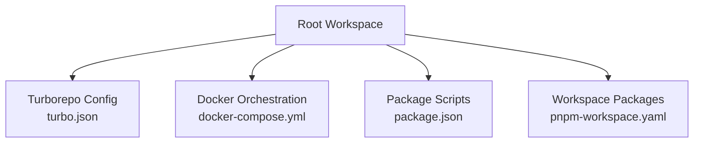
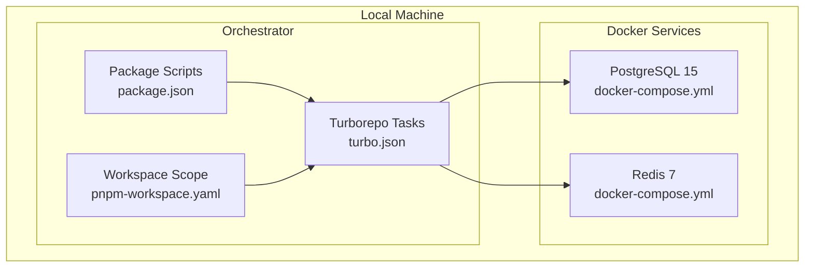
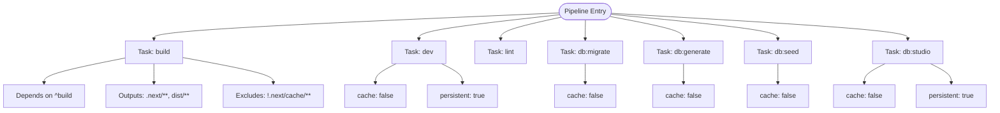
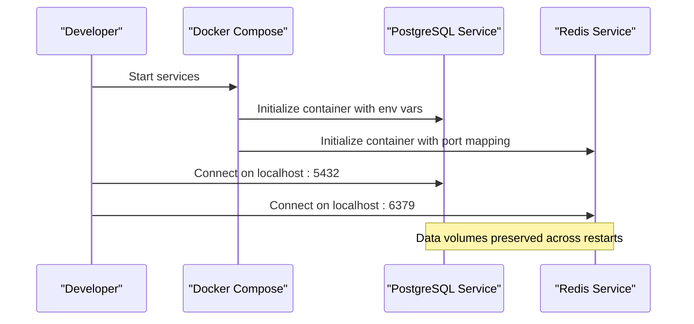
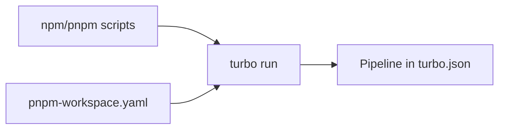
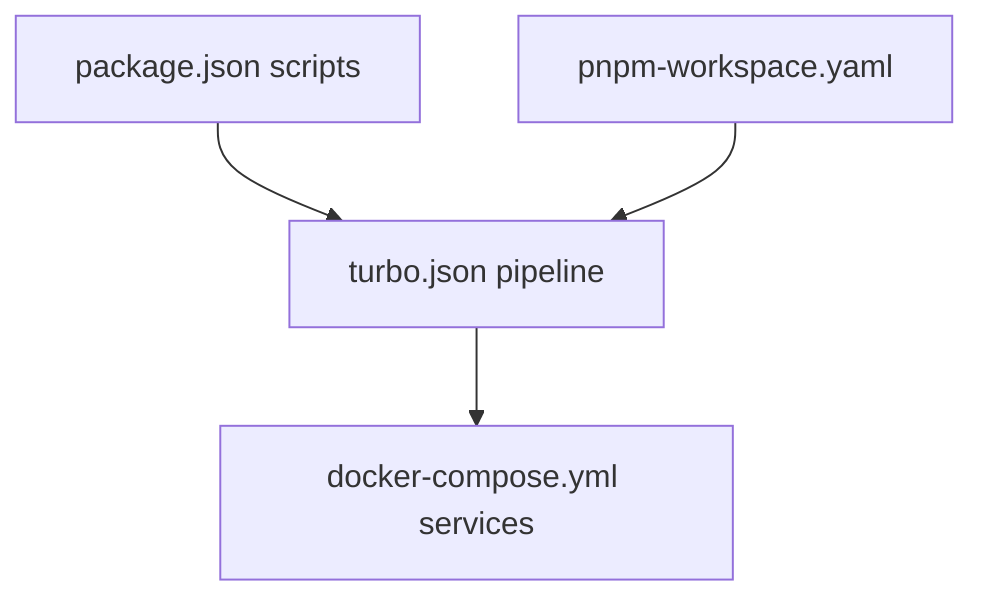

# Development Environment

<cite>
**Referenced Files in This Document**
- [turbo.json](file://turbo.json)
- [docker-compose.yml](file://docker-compose.yml)
- [package.json](file://package.json)
- [pnpm-workspace.yaml](file://pnpm-workspace.yaml)
</cite>

## Table of Contents
1. [Introduction](#introduction)
2. [Project Structure](#project-structure)
3. [Core Components](#core-components)
4. [Architecture Overview](#architecture-overview)
5. [Detailed Component Analysis](#detailed-component-analysis)
6. [Dependency Analysis](#dependency-analysis)
7. [Performance Considerations](#performance-considerations)
8. [Troubleshooting Guide](#troubleshooting-guide)
9. [Conclusion](#conclusion)

## Introduction
This document describes the development environment for the Secure Refund Bank project. It focuses on the Turborepo configuration for building, caching, and development workflows; Docker Compose orchestration for PostgreSQL and Redis; and practical development commands and environment management. It also covers database-related tasks such as migrations, schema generation, and studio access during development.

## Project Structure
The repository root defines the monorepo workspace and build orchestration:
- Turborepo pipeline configuration
- Docker Compose services for databases
- Package scripts wired to Turborepo tasks
- PNPM workspace definition

**Diagram sources**
- [turbo.json:1-29](file://turbo.json#L1-L29)
- [docker-compose.yml:1-29](file://docker-compose.yml#L1-L29)
- [package.json:1-22](file://package.json#L1-L22)
- [pnpm-workspace.yaml:1-4](file://pnpm-workspace.yaml#L1-L4)

**Section sources**
- [turbo.json:1-29](file://turbo.json#L1-L29)
- [docker-compose.yml:1-29](file://docker-compose.yml#L1-L29)
- [package.json:1-22](file://package.json#L1-L22)
- [pnpm-workspace.yaml:1-4](file://pnpm-workspace.yaml#L1-L4)

## Core Components
- Turborepo pipeline orchestrates build, dev, lint, and database tasks with cache and persistence controls.
- Docker Compose provisions PostgreSQL and Redis with named volumes for persistence.
- Package scripts delegate to Turborepo tasks for unified developer experience.
- PNPM workspace scopes packages under apps and packages.

Key behaviors:
- Build pipeline depends on upstream builds and outputs Next.js and distribution artifacts while excluding caches.
- Dev task disables caching and marks as persistent for long-running development servers.
- Database tasks (migrate, generate, seed, studio) disable caching to ensure deterministic operations.
- Docker services expose ports and persist data via named volumes.

**Section sources**
- [turbo.json:1-29](file://turbo.json#L1-L29)
- [docker-compose.yml:1-29](file://docker-compose.yml#L1-L29)
- [package.json:1-22](file://package.json#L1-L22)
- [pnpm-workspace.yaml:1-4](file://pnpm-workspace.yaml#L1-L4)

## Architecture Overview
The development stack integrates Turborepo orchestration with Dockerized infrastructure. Turborepo runs tasks across packages defined in the workspace, while Docker Compose manages relational and in-memory data services.

**Diagram sources**
- [turbo.json:1-29](file://turbo.json#L1-L29)
- [package.json:1-22](file://package.json#L1-L22)
- [pnpm-workspace.yaml:1-4](file://pnpm-workspace.yaml#L1-L4)
- [docker-compose.yml:1-29](file://docker-compose.yml#L1-L29)

## Detailed Component Analysis

### Turborepo Pipeline
The pipeline defines task categories and their caching/persistence characteristics:
- build: depends on upstream packages, outputs Next.js and distribution artifacts, excludes cache directories.
- dev: disables caching and marks as persistent for long-running development servers.
- lint: no special caching configuration.
- db:migrate, db:generate, db:seed: disabled caching for deterministic database operations.
- db:studio: disabled caching and marked persistent for interactive database tooling.

**Diagram sources**
- [turbo.json:4-27](file://turbo.json#L4-L27)

**Section sources**
- [turbo.json:1-29](file://turbo.json#L1-L29)

### Docker Compose Orchestration
Compose defines two primary services:
- PostgreSQL 15 with credentials and database name, port-mapped and persisted via a named volume.
- Redis 7 with port-mapped and persisted via a named volume.

**Diagram sources**
- [docker-compose.yml:3-29](file://docker-compose.yml#L3-L29)

**Section sources**
- [docker-compose.yml:1-29](file://docker-compose.yml#L1-L29)

### Package Scripts and Workspace
- Scripts delegate to Turborepo tasks for build, dev, lint, and database operations.
- Workspace scoping ensures PNPM installs and links packages under apps and packages.

**Diagram sources**
- [package.json:5-12](file://package.json#L5-L12)
- [turbo.json:4-27](file://turbo.json#L4-L27)
- [pnpm-workspace.yaml:1-4](file://pnpm-workspace.yaml#L1-L4)

**Section sources**
- [package.json:1-22](file://package.json#L1-L22)
- [pnpm-workspace.yaml:1-4](file://pnpm-workspace.yaml#L1-L4)

## Dependency Analysis
The development environment exhibits clear separation of concerns:
- Turborepo coordinates task execution and caching across packages.
- Docker Compose provides isolated, persistent infrastructure services.
- Package scripts act as a thin layer over Turborepo tasks.
- Workspace configuration scopes package discovery.

**Diagram sources**
- [package.json:5-12](file://package.json#L5-L12)
- [turbo.json:4-27](file://turbo.json#L4-L27)
- [docker-compose.yml:3-29](file://docker-compose.yml#L3-L29)
- [pnpm-workspace.yaml:1-4](file://pnpm-workspace.yaml#L1-L4)

**Section sources**
- [package.json:1-22](file://package.json#L1-L22)
- [turbo.json:1-29](file://turbo.json#L1-L29)
- [docker-compose.yml:1-29](file://docker-compose.yml#L1-L29)
- [pnpm-workspace.yaml:1-4](file://pnpm-workspace.yaml#L1-L4)

## Performance Considerations
- Build caching: Build outputs exclude cache directories to reduce unnecessary cache invalidation.
- Dev mode: Disabling cache for dev enables fast iteration but increases cold starts; persistent tasks keep long-running servers alive.
- Database tasks: Disabling cache ensures deterministic migrations and schema operations.
- Docker volumes: Named volumes persist data across container restarts, reducing reinitialization overhead.

[No sources needed since this section provides general guidance]

## Troubleshooting Guide
Common development scenarios and resolutions:
- Services not reachable locally:
  - Verify ports are free and not conflicting with other processes.
  - Confirm service health and logs after startup.
- Data loss after container restart:
  - Ensure named volumes are present and mounted correctly.
- Dev server not updating:
  - Confirm dev task is persistent and cache is disabled per pipeline configuration.
- Database operations failing:
  - Run migration and generation tasks with cache disabled as configured.
- Environment variables:
  - Global dependencies include local env files; ensure environment files exist and are loaded by tasks.

**Section sources**
- [turbo.json:3-11](file://turbo.json#L3-L11)
- [turbo.json:14-26](file://turbo.json#L14-L26)
- [docker-compose.yml:14-24](file://docker-compose.yml#L14-L24)

## Conclusion
The development environment leverages Turborepo for efficient task orchestration and Docker Compose for reliable local infrastructure. The configuration emphasizes deterministic database operations, persistent development servers, and robust caching policies. Together, these components provide a scalable and maintainable foundation for building the Secure Refund Bank platform.