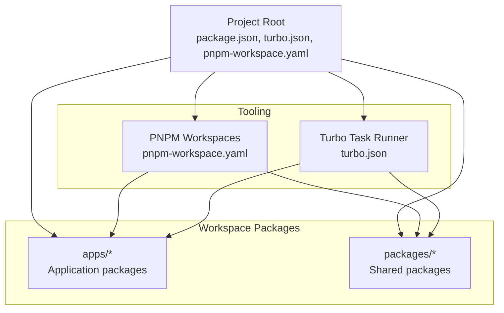

# Getting Started

<cite>
**Referenced Files in This Document**
- [docker-compose.yml](file://docker-compose.yml)
- [package.json](file://package.json)
- [pnpm-workspace.yaml](file://pnpm-workspace.yaml)
- [turbo.json](file://turbo.json)
</cite>

## Table of Contents
1. [Introduction](#introduction)
2. [Prerequisites](#prerequisites)
3. [Installation](#installation)
4. [First-Time Developer Workflow](#first-time-developer-workflow)
5. [Environment Setup and Ports](#environment-setup-and-ports)
6. [Project Verification](#project-verification)
7. [Monorepo Structure Overview](#monorepo-structure-overview)
8. [Common Commands Reference](#common-commands-reference)
9. [Troubleshooting](#troubleshooting)
10. [Next Steps](#next-steps)

## Introduction
Welcome to the Secure Refund Bank project. This guide will help you set up your local development environment, understand the project structure, and start contributing effectively. The project uses a modern monorepo approach with Docker for services, PNPM for package management, and Turbo for task orchestration.

## Prerequisites
Before you begin, ensure you have the following installed on your development machine:

- **Node.js**: Version 18.0.0 or higher
- **PNPM**: Version 9.0.0 specifically
- **Docker**: Docker Engine and Docker Compose support
- **Git**: For cloning the repository

These requirements are enforced by the project configuration and will be validated during setup.

**Section sources**
- [package.json:17-20](file://package.json#L17-L20)
- [package.json:14-16](file://package.json#L14-L16)

## Installation
Follow these steps to install and configure your development environment:

### Step 1: Clone the Repository
Clone the repository to your local machine using Git.

### Step 2: Install Dependencies
Navigate to the project root directory and install all dependencies using PNPM:

```bash
pnpm install
```

This command will:
- Install all workspace packages
- Configure the monorepo structure
- Set up inter-package dependencies

### Step 3: Start Docker Services
The project requires PostgreSQL and Redis services. Start them using Docker Compose:

```bash
docker compose up -d
```

This command will:
- Pull the required Docker images
- Start PostgreSQL (port 5432) and Redis (port 6379)
- Persist data in named volumes

### Step 4: Verify Service Status
Ensure both services are running:

```bash
docker compose ps
```

You should see both `postgres` and `redis` containers in the `Up` state.

**Section sources**
- [docker-compose.yml:3-28](file://docker-compose.yml#L3-L28)
- [package.json:5-12](file://package.json#L5-L12)

## First-Time Developer Workflow
Once your environment is configured, follow this workflow to start developing:

### Step 1: Run Development Servers
Start the development servers for all workspace packages:

```bash
pnpm dev
```

This command delegates to Turbo to start all development servers defined in your workspace packages.

### Step 2: Access Database Services
The database services are available locally:

- **PostgreSQL**: Host: localhost, Port: 5432
- **Redis**: Host: localhost, Port: 6379

You can connect using your preferred database clients or tools.

### Step 3: Run Database Operations
Use the following commands for database management:

```bash
# Run database migrations
pnpm db:migrate

# Generate database artifacts
pnpm db:generate

# Seed the database
pnpm db:seed

# Open database studio
pnpm db:studio
```

Each command is delegated to Turbo and executed across relevant workspace packages.

**Section sources**
- [package.json:5-12](file://package.json#L5-L12)
- [turbo.json:14-26](file://turbo.json#L14-L26)

## Environment Setup and Ports
The project exposes the following ports for local development:

- **PostgreSQL**: Port 5432
- **Redis**: Port 6379

These ports are configured in the Docker Compose file and are essential for connecting database clients and applications.

**Section sources**
- [docker-compose.yml:12-22](file://docker-compose.yml#L12-L22)

## Project Verification
To verify your setup is working correctly:

### Verify Docker Services
```bash
docker compose ps
```
Ensure both containers are running.

### Test Database Connectivity
Connect to PostgreSQL using your database client with:
- Host: localhost
- Port: 5432
- Database: secure_refund_bank
- Username: srb_user
- Password: srb_password

### Test Redis Connectivity
Connect to Redis using your Redis client with:
- Host: localhost
- Port: 6379

### Verify Package Scripts
List available scripts:
```bash
pnpm run
```

You should see the development and database-related scripts defined in the root package.json.

**Section sources**
- [docker-compose.yml:8-11](file://docker-compose.yml#L8-L11)
- [package.json:5-12](file://package.json#L5-L12)

## Monorepo Structure Overview
The project follows a monorepo architecture managed by PNPM workspaces:



**Diagram sources**
- [pnpm-workspace.yaml:1-3](file://pnpm-workspace.yaml#L1-L3)
- [turbo.json:1-28](file://turbo.json#L1-L28)

Key characteristics:
- **Workspace Definition**: Packages located in `apps/*` and `packages/*` directories
- **Task Orchestration**: Turbo manages build, dev, lint, and database tasks
- **Package Management**: PNPM enforces version constraints and workspace relationships

**Section sources**
- [pnpm-workspace.yaml:1-3](file://pnpm-workspace.yaml#L1-L3)
- [turbo.json:1-28](file://turbo.json#L1-L28)

## Common Commands Reference
Here are the primary commands you'll use during development:

### Development Commands
- **pnpm dev**: Start all development servers
- **pnpm build**: Build all packages
- **pnpm lint**: Run lint checks across packages

### Database Commands
- **pnpm db:migrate**: Execute database migrations
- **pnpm db:generate**: Generate database artifacts
- **pnpm db:seed**: Populate database with seed data
- **pnpm db:studio**: Open database management interface

### Docker Commands
- **docker compose up -d**: Start all services
- **docker compose down**: Stop all services
- **docker compose ps**: List running services
- **docker compose logs**: View service logs

**Section sources**
- [package.json:5-12](file://package.json#L5-L12)
- [turbo.json:14-26](file://turbo.json#L14-L26)

## Troubleshooting
Common issues and solutions:

### Docker Port Conflicts
If ports 5432 or 6379 are already in use:
```bash
# Check what's using the ports
netstat -ano | findstr :5432
netstat -ano | findstr :6379

# Stop conflicting services or update docker-compose.yml ports
```

### Permission Issues with Docker Volumes
If you encounter permission errors:
```bash
# Grant proper permissions to volume directories
sudo chown -R $(whoami) postgres_data/
sudo chown -R $(whoami) redis_data/
```

### PNPM Version Mismatch
Ensure you're using PNPM 9.0.0:
```bash
# Check PNPM version
pnpm --version

# If incorrect version, install the required version
npm install -g pnpm@9.0.0
```

### Node.js Version Issues
Verify your Node.js version meets the requirement:
```bash
node --version
# Must be >= 18.0.0
```

### Database Connection Problems
If applications cannot connect to the database:
```bash
# Verify services are running
docker compose ps

# Check service logs
docker compose logs postgres
docker compose logs redis

# Restart services if needed
docker compose restart
```

## Next Steps
After successful setup, consider these next steps:

1. **Explore Workspace Packages**: Navigate to `apps/` and `packages/` directories to understand the project structure
2. **Review Application Configuration**: Examine individual app configurations in the apps directory
3. **Set Up Environment Variables**: Create `.env.local` files as needed for your development environment
4. **Run Individual Package Dev Servers**: Start specific package development servers for focused development
5. **Contribute to Documentation**: Add your findings to improve the developer experience

Remember to keep your Docker services running during development and use the provided scripts for consistent development workflows.