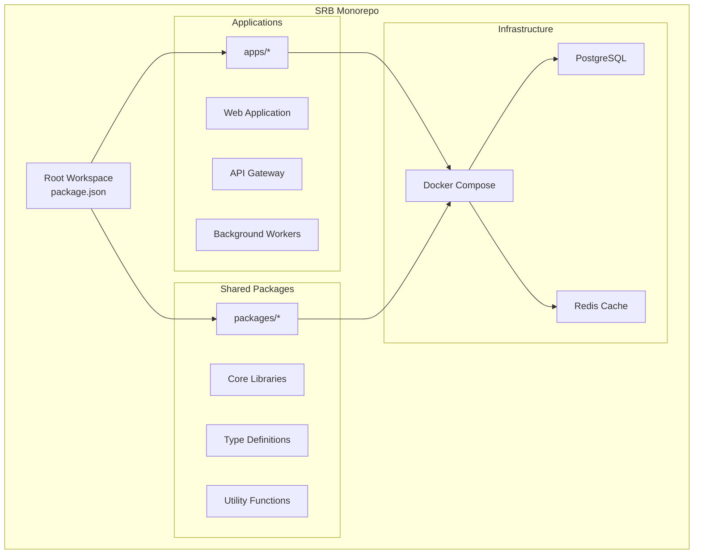
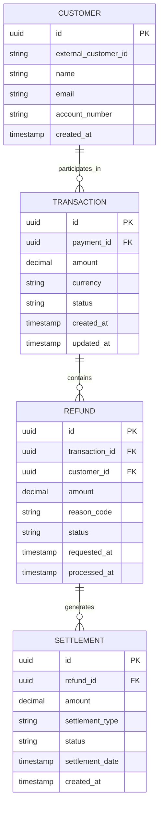
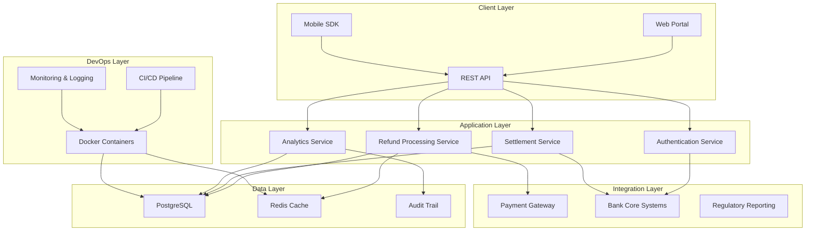
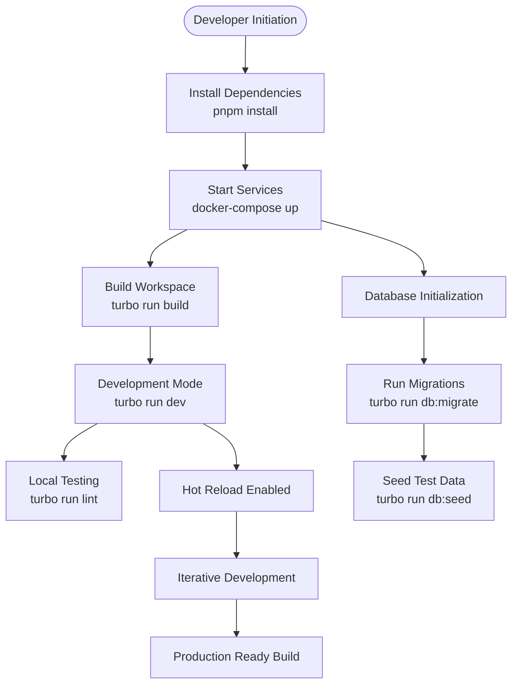
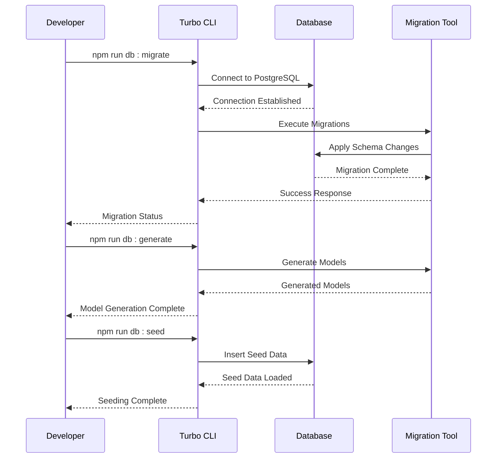
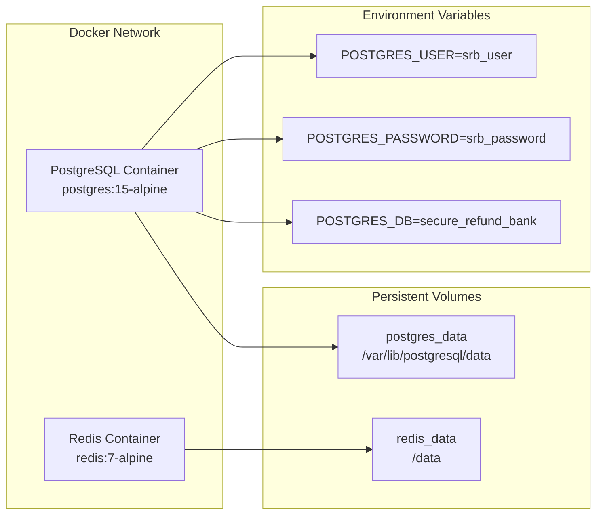
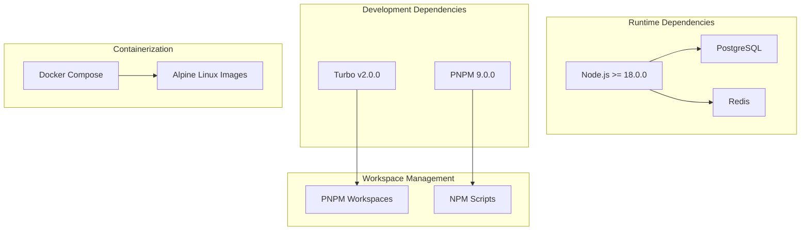

# Project Overview

<cite>
**Referenced Files in This Document**
- [docker-compose.yml](file://docker-compose.yml)
- [package.json](file://package.json)
- [pnpm-workspace.yaml](file://pnpm-workspace.yaml)
- [turbo.json](file://turbo.json)
</cite>

## Table of Contents
1. [Introduction](#introduction)
2. [Project Structure](#project-structure)
3. [Core Components](#core-components)
4. [Architecture Overview](#architecture-overview)
5. [Detailed Component Analysis](#detailed-component-analysis)
6. [Dependency Analysis](#dependency-analysis)
7. [Performance Considerations](#performance-considerations)
8. [Troubleshooting Guide](#troubleshooting-guide)
9. [Conclusion](#conclusion)
10. [Appendices](#appendices)

## Introduction
Secure Refund Bank (SRB) is a banking infrastructure foundation designed to streamline refund processing for financial institutions and fintech companies. The platform provides a scalable, modular architecture for managing financial transaction reversals, chargebacks, and settlement reconciliation. SRB targets the growing demand for efficient refund automation while maintaining compliance with banking standards and regulatory requirements.

The platform's core objectives include:
- Establishing a robust foundation for automated refund processing
- Supporting high-throughput transaction processing with real-time settlement capabilities
- Providing extensible APIs for seamless integration with existing banking systems
- Ensuring compliance with financial regulations and security standards
- Enabling rapid deployment and scaling for both traditional banks and digital-first financial services

## Project Structure
The SRB project follows a modern monorepo architecture leveraging PNPM workspaces and Turbo for efficient development workflows. The repository is organized into distinct application and package directories managed through workspace configuration.

**Diagram sources**
- [pnpm-workspace.yaml:1-4](file://pnpm-workspace.yaml#L1-L4)
- [docker-compose.yml:3-29](file://docker-compose.yml#L3-L29)

The monorepo structure enables:
- Shared code reuse across applications
- Consistent development tooling and standards
- Isolated dependency management per package
- Streamlined CI/CD pipelines with caching
- Centralized configuration management

**Section sources**
- [pnpm-workspace.yaml:1-4](file://pnpm-workspace.yaml#L1-L4)
- [package.json:1-22](file://package.json#L1-L22)

## Core Components
The SRB platform consists of several interconnected components that work together to provide comprehensive refund processing capabilities.

### Database Infrastructure
The platform utilizes PostgreSQL as its primary data store, configured with dedicated credentials and persistent volume management for production deployments.

**Diagram sources**
- [docker-compose.yml:4-15](file://docker-compose.yml#L4-L15)

### Caching Layer
Redis serves as the caching layer for session management, rate limiting, and temporary data storage, providing low-latency access to frequently accessed refund information.

### Development Workflow
Turbo orchestrates the build pipeline with specialized tasks for database operations, enabling efficient development cycles and deployment automation.

**Section sources**
- [docker-compose.yml:4-29](file://docker-compose.yml#L4-L29)
- [turbo.json:1-29](file://turbo.json#L1-L29)

## Architecture Overview
The SRB architecture follows a microservices-oriented monorepo pattern with clear separation of concerns and standardized development practices.

**Diagram sources**
- [docker-compose.yml:3-29](file://docker-compose.yml#L3-L29)
- [turbo.json:4-27](file://turbo.json#L4-L27)

The architecture emphasizes:
- **Scalability**: Horizontal scaling through containerization and microservices
- **Reliability**: Persistent storage with backup and recovery mechanisms
- **Security**: Encrypted communications and access controls
- **Compliance**: Audit trails and regulatory reporting capabilities
- **Performance**: Caching strategies and optimized database queries

## Detailed Component Analysis

### Development Environment Setup
The project establishes a comprehensive development environment using modern tooling and containerization.

**Diagram sources**
- [package.json:5-12](file://package.json#L5-L12)
- [turbo.json:9-12](file://turbo.json#L9-L12)

### Database Management Operations
The platform provides comprehensive database lifecycle management through standardized scripts and workflows.

**Diagram sources**
- [package.json:9-12](file://package.json#L9-L12)
- [turbo.json:14-22](file://turbo.json#L14-L22)

**Section sources**
- [package.json:5-12](file://package.json#L5-L12)
- [turbo.json:1-29](file://turbo.json#L1-L29)

### Container Orchestration
Docker Compose manages the complete runtime environment with persistent storage and network isolation.

**Diagram sources**
- [docker-compose.yml:4-24](file://docker-compose.yml#L4-L24)

**Section sources**
- [docker-compose.yml:1-29](file://docker-compose.yml#L1-L29)

## Dependency Analysis
The SRB project maintains a clean dependency graph focused on essential banking infrastructure components and modern development practices.

**Diagram sources**
- [package.json:18-20](file://package.json#L18-L20)
- [package.json:14-16](file://package.json#L14-L16)
- [docker-compose.yml:5,18](file://docker-compose.yml#L5,L18)

Key dependency characteristics:
- **Minimal footprint**: Only essential dependencies for banking operations
- **Modern runtime**: Latest Node.js LTS with long-term support
- **Efficient container images**: Alpine-based containers for reduced resource usage
- **Standardized tooling**: Consistent development experience across teams

**Section sources**
- [package.json:14-20](file://package.json#L14-L20)
- [docker-compose.yml:5,18](file://docker-compose.yml#L5,L18)

## Performance Considerations
The SRB architecture incorporates several performance optimization strategies tailored for financial transaction processing.

### Database Performance
- **Connection pooling**: Optimized connection management for high-throughput refund processing
- **Index optimization**: Strategic indexing for refund status queries and settlement operations
- **Transaction isolation**: Proper isolation levels for concurrent refund operations
- **Backup strategies**: Automated backup scheduling for disaster recovery

### Caching Strategy
- **Session caching**: Redis for user sessions and rate limiting
- **Query result caching**: Frequently accessed refund statuses cached for improved response times
- **Cache invalidation**: Event-driven cache updates for data consistency

### Container Optimization
- **Resource limits**: Configured memory and CPU limits for predictable performance
- **Health checks**: Container health monitoring for automatic recovery
- **Scaling policies**: Horizontal scaling based on refund processing load

## Troubleshooting Guide

### Development Environment Issues
Common development environment problems and solutions:

**Database Connection Failures**
- Verify PostgreSQL service is running: `docker-compose ps postgres`
- Check database credentials in environment variables
- Ensure port 5432 is not blocked by firewall
- Confirm database initialization completed successfully

**Redis Connectivity Problems**
- Validate Redis service status: `docker-compose ps redis`
- Check Redis port availability (6379)
- Verify cache persistence volumes are accessible

**Build Pipeline Errors**
- Clear Turbo cache: `turbo clean`
- Reinstall dependencies: `pnpm install`
- Check Node.js version compatibility
- Verify workspace configuration integrity

### Production Deployment Challenges
**Performance Bottlenecks**
- Monitor refund processing queue length
- Analyze database query performance
- Review Redis cache hit rates
- Scale container resources based on load metrics

**Data Integrity Concerns**
- Validate refund audit trails
- Monitor settlement reconciliation accuracy
- Check for duplicate refund processing
- Review transaction rollback procedures

**Security and Compliance**
- Regular security patch updates
- Access log monitoring
- Encryption at rest and in transit
- Compliance reporting automation

**Section sources**
- [docker-compose.yml:7,20](file://docker-compose.yml#L7,L20)
- [turbo.json:9,25](file://turbo.json#L9,L25)

## Conclusion
Secure Refund Bank represents a modern, scalable solution for financial institutions seeking to automate and optimize their refund processing capabilities. The platform's monorepo architecture, combined with containerized infrastructure and standardized development practices, provides a solid foundation for building robust financial services.

Key strengths of the SRB platform include:
- **Enterprise-grade architecture**: Designed for high availability and scalability
- **Comprehensive tooling**: Modern development workflow with automated testing and deployment
- **Financial focus**: Built specifically for banking and fintech use cases
- **Future-proof design**: Modular components ready for extension and customization

The platform positions itself as a critical infrastructure component for financial institutions looking to enhance their operational efficiency while maintaining compliance with banking standards and regulatory requirements.

## Appendices

### Technology Stack Summary
- **Runtime Environment**: Node.js 18+ with TypeScript support
- **Database**: PostgreSQL 15 with advanced transaction support
- **Caching**: Redis 7 for session and cache management
- **Containerization**: Docker Compose with Alpine Linux base images
- **Build System**: Turbo for monorepo optimization
- **Package Management**: PNPM workspace configuration

### Target Use Cases
- **Traditional Banks**: Automated refund processing for card transactions
- **Fintech Companies**: Settlement reconciliation for digital payment platforms
- **Payment Providers**: Chargeback management and dispute resolution
- **E-commerce Platforms**: Order cancellation and refund automation
- **Subscription Services**: Recurring billing and prorated refund processing

### Implementation Roadmap
1. **Phase 1**: Core refund processing engine
2. **Phase 2**: Multi-currency and international settlement
3. **Phase 3**: Advanced analytics and reporting
4. **Phase 4**: Regulatory compliance automation
5. **Phase 5**: Integration marketplace for third-party services